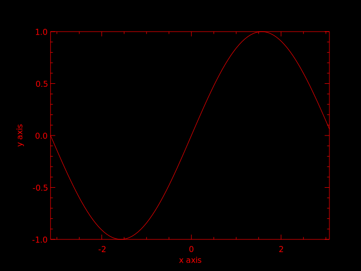

# Plotting in Emacs Lisp 

_Work In Progress and Proof Of Concept_

I like Racket drawing packages, such as `pict`, `plot` and `2htdp/image`, they
are easy and fun to use, you can manipulate images like ordinary values, for
example, the following creates two images then append them vertically:

``` racket
;; Racekt
(vc-append (circle 100) (text "Moon"))
```

It would be nice if we can have this kind of pacakges for Emacs. This repo uses
[PLplot](http://plplot.org/) via Emacs dynamic module, it lets you plot in Emacs
Lisp, for example, this plot `y = sin(x)`, `x` within `[-pi, pi]`:

``` emacs-lisp
;; Emacs Lisp
(insert-image-file (plplot #'sin (- pi) pi))
```



## Setup

You're going to need PLplot to build the dynamic module, you should be able to
install it with your OS package manager, for example, macOS/Homebrew users can
use:

    $ brew install plplot

Build the dynamic module:

    $ make
    cc -Wall -shared -fpic -lplplot plplot-module.c -o plplot-module.so

Setup `load-path` and load the package:

``` emacs-lisp
(add-to-list 'load-path "~/src/plplot.el")
(require 'plplot)
```

Use-package users can achieve the above with:

``` emacs-lisp
(use-package plplot
  :load-path "~/src/plplot.el")
```

## API

### `(plplot func x-min x-max xlabel ylabel title samples outfile)`

Plot `y=FUNC(x)` from `X-MIN` to `X-MAX`.

### `(plplot-bar-chart ys xlabel ylabel title samples outfile)`

Plot `ys` in bar chart.

## Requires

- Emacs 25
